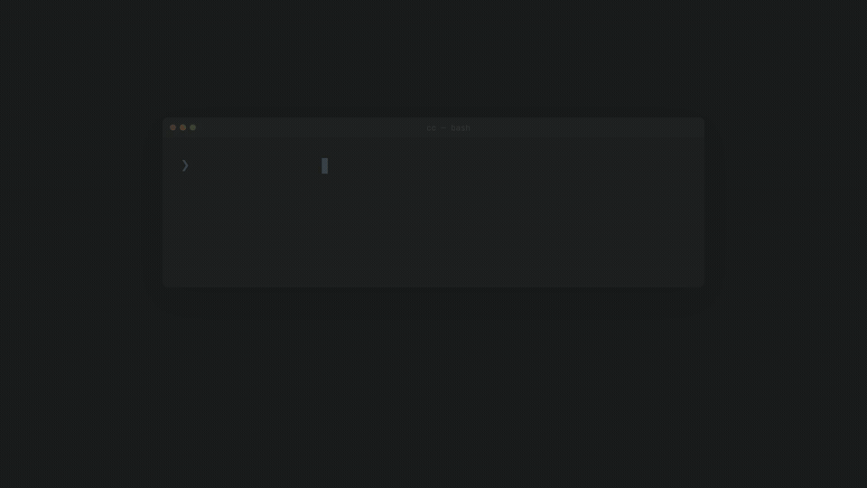
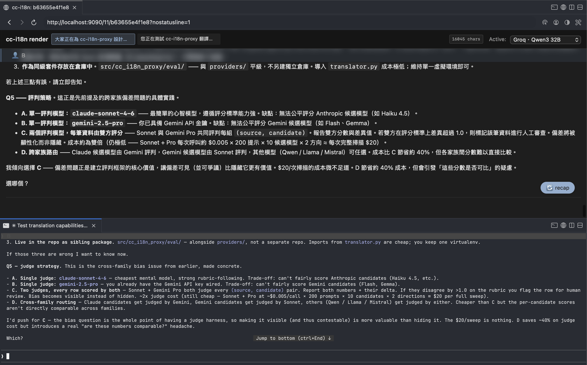

# cc-translate-proxy

A sidecar translation proxy for [Claude Code](https://claude.com/claude-code). It separates the language you use in the local Claude Code interface from the language sent to Claude.

Public repo: https://github.com/0x7067/cc-translate-proxy

There are two common workflows:

- `chinese-claude`: use English inside Claude Code; Claude-facing user and assistant history is Simplified Chinese; no `/intl` command is needed.
- Manual `/intl`: write prompts in Traditional Chinese; the proxy sends English to Claude, returns English to Claude Code, and renders Traditional Chinese in a local web UI.



## Why

The core idea is simple: the language Claude Code shows locally does not need to be the language Claude sees in its context. The original goal was to let Traditional Chinese users keep the Claude-facing context in English. The proxy later added the reverse flow: an English interface with Simplified Chinese upstream context.

Two things made the sidecar worth building:

1. **Claude Code is steadier in English than Chinese.** Anthropic's [multilingual benchmark](https://platform.claude.com/docs/en/build-with-claude/multilingual-support) reports Sonnet 4.5 Simplified Chinese MMLU at 96.9% of English. A recent [vibe coding benchmark paper](https://arxiv.org/abs/2604.14210) also reports that Chinese prompts solve 4.5-9.9 percentage points fewer tasks than English prompts. Equivalent Chinese text can cost more tokens too: [Petrov et al. 2023](https://arxiv.org/abs/2305.15425) measured cross-language token count differences as high as 15x. Claude Code also tends to follow the language of the last user message, so mixed Chinese-English sessions can pull an entire conversation into Chinese.
2. **Sonnet can drift into Korean or Japanese.** Traditional Chinese users have reproduced this in [#30025](https://github.com/anthropics/claude-code/issues/30025), where Chinese text suddenly switches to Korean, and [#46846](https://github.com/anthropics/claude-code/issues/46846), where a `CLAUDE.md` instruction says Traditional Chinese but Claude replies in Japanese. Prompting and `CLAUDE.md` reminders do not fully prevent it.

`cc-translate-proxy` sits between Claude Code and `api.anthropic.com`. It translates user prompts, assistant replies, and later conversation history according to the active mode:

- Manual `/intl` mode: Traditional Chinese prompts are translated to English before they reach Claude. Claude's English reply is returned unchanged to Claude Code, and another copy is translated to Traditional Chinese for the local render UI.
- Background reverse mode: English prompts are translated to Simplified Chinese before they reach Claude. Claude's Simplified Chinese reply is translated back to English before it returns to the Claude Code TUI.

## Screenshot



The top half is the local Traditional Chinese render from cc-translate-proxy at `localhost:9090/<uuid>`. The bottom half is the English conversation seen by the Claude Code TUI. It is the same turn from two language perspectives. The `?nostatusline=1` query hides the bottom status line for local screenshots.

## How It Works

```
You send a Traditional Chinese prompt
   |
   v
cc-translate-proxy intercepts /v1/messages
   |- translates Traditional Chinese to English
   |- sends the English request to api.anthropic.com
   `- forks the English response -> translates it to Traditional Chinese -> renders it locally

Claude Code sees clean English context; you read the Traditional Chinese render in a browser.
```

## Before You Use It

- **Your prompts and Claude Code replies go to a third-party LLM** for translation. The default provider is Gemini Flash. Do not use this proxy for sessions with sensitive content.
- **The proxy writes two local conversation records.** Audit logs, including the full before-and-after prompt and reply JSONL, live in `~/.cc-i18n-proxy/audit/`. Render emit files, including translated markdown, live in `~/.cc-i18n-proxy/emit/`. Both directories contain full conversation content and should be cleaned regularly.
- **This is a personal experiment, not production software.** Expect bugs.

## Quick Start

Requirements: Python 3.12+ and [`uv`](https://github.com/astral-sh/uv).

1. Clone and install:
   ```bash
   git clone https://github.com/0x7067/cc-translate-proxy.git
   cd cc-translate-proxy
   uv sync
   ```

2. Configure the translation provider chain:
   ```bash
   mkdir -p ~/.cc-i18n-proxy
   cp providers.toml.example ~/.cc-i18n-proxy/providers.toml
   ```

   `default_chain` in `providers.toml` controls the provider order. The proxy tries the first provider and falls back to the next one only on failure. The example defaults to `["gemini", "groq", "openrouter"]`. You can reduce it to one provider or add `"ollama"` for a local no-key option.

3. Write matching API keys to `~/.cc-i18n-proxy/.env`. The environment variable names must match each provider's `api_key_env` setting in `providers.toml`.
   ```bash
   cat > ~/.cc-i18n-proxy/.env <<'EOF'
   GEMINI_API_KEY=your-key-here
   # GROQ_API_KEY=...
   # OPENROUTER_API_KEY=...
   EOF
   ```

   Key pages: [Gemini](https://aistudio.google.com/apikey), [Groq](https://console.groq.com/keys), [OpenRouter](https://openrouter.ai/keys). One configured provider is enough. Providers without keys are automatically removed from the chain.

4. Start the persistent background proxy:
   ```bash
   ./scripts/proxy-background.sh start
   ```

   This installs or refreshes a macOS user LaunchAgent and keeps only the proxy running in the background. The default background mode uses English locally, sends Simplified Chinese to Claude, and sets `CC_I18N_AUTO_TRANSLATE=1`, so `/intl` is not needed.

5. Launch Claude Code through the wrapper:
   ```bash
   chinese-claude
   ```

   If the wrapper from this repo is not on your `$PATH`, run it from the repo:
   ```bash
   ./chinese-claude
   ```

   The wrapper is equivalent to:
   ```bash
   export ANTHROPIC_BASE_URL=http://localhost:8080
   export ENABLE_TOOL_SEARCH=auto
   claude
   ```

Manage the background service:

```bash
./scripts/proxy-background.sh status
./scripts/proxy-background.sh logs
./scripts/proxy-background.sh stop
./scripts/proxy-background.sh restart
./scripts/proxy-background.sh uninstall
```

The render web UI is optional. Start it only when you want the browser view:

```bash
./scripts/proxy-background.sh start-render
./scripts/proxy-background.sh stop-render
```

To keep the older manual `/intl` flow, start passthrough mode manually:

```bash
uv run python -m cc_i18n_proxy > /tmp/proxy.log 2>&1 &
uv run python scripts/render_server.py > /tmp/render.log 2>&1 &
```

Then run `/intl` in any `claude` session to enable translation.

By default, the proxy runs in **passthrough mode**: it forwards exactly what you type. `/intl` adds the current session to the translation allowlist. It creates a session UUID, inserts a marker into the conversation, and later shows the Traditional Chinese render at `http://localhost:9090/<uuid>`. Run `/normal` to leave translation mode.

## Configure the `/intl` Skill

`/intl` is a Claude Code skill, not part of the proxy itself. Put this minimal template in `~/.claude/skills/intl/SKILL.md`:

````markdown
---
name: intl
description: Enable cc-translate-proxy translation mode for the current session.
---

Generate a 12-hex session UUID and emit the proxy marker. The proxy will see the marker on the next outbound request and add this session to the translation allowlist.

```bash
UUID=$(python3 -c "import secrets; print(secrets.token_hex(6))")
echo "[CC_I18N_PROXY:ENABLE_THIS_SESSION:uuid=$UUID]"
echo "Render UI: http://localhost:9090/$UUID"
```

Keep this skill output in the conversation history so `/resume` and proxy restarts can recover the marker.
````

The matching `~/.claude/skills/normal/SKILL.md` should emit `[CC_I18N_PROXY:DISABLE_THIS_SESSION:uuid=<uuid>]` to exit translation mode.

The marker can include workspace metadata. The render home page groups sessions by workspace when several projects run at once:

```
[CC_I18N_PROXY:ENABLE_THIS_SESSION:uuid=<uuid>:workspace=<id>:workspace_name=<name>]
```

Without workspace metadata, sessions go into the `default` group.

## Notes

- **Auto-compaction can remove the marker.** After roughly 50+ turns, Claude Code may compact early messages into a summary and drop the `/intl` marker. Run `/intl` again if that happens.
- **Claude Code disables ToolSearch on non-first-party hosts.** Set `ENABLE_TOOL_SEARCH=auto` to turn deferred MCP loading back on. The proxy does not modify `tool_reference` blocks, so this is safe.
- **Translation is not free.** Gemini Flash is cheap, but not zero-cost. Heavy users should monitor spend. Provider failover can spread traffic across several providers.

## Environment Variables

| Variable | Default | Purpose |
|---|---|---|
| `CC_I18N_PROXY_HOME` | `~/.cc-i18n-proxy` | Root directory for config, audit logs, emit files, and state |
| `CC_I18N_PROXY_PORT` | `8080` | Proxy listen port |
| `CC_I18N_RENDER_PORT` | `9090` | Render server listen port |
| `CC_I18N_PROXY_EMIT_DIR` | `$CC_I18N_PROXY_HOME/emit` | Output directory for translated emit files |
| `CC_I18N_USER_LANG` | `zh` | Language used by the user and render UI |
| `CC_I18N_CLAUDE_LANG` | `en` | Language sent to Claude |
| `CC_I18N_REWRITE_TUI` | `auto` | Whether assistant text returned to the Claude Code TUI is translated back to the user language. This turns on by default when `CC_I18N_CLAUDE_LANG` is not `en` |
| `CC_I18N_AUTO_TRANSLATE` | `0` | Translate every request through the proxy without requiring the `/intl` marker |

For the reverse flow, where you use English locally and send Simplified Chinese to Claude, run:

```bash
./scripts/claude-english.sh
```

Then use Claude Code normally. You type and read English. Claude-facing user and assistant history is Simplified Chinese.

Manual startup is equivalent to:

```bash
export CC_I18N_USER_LANG=en
export CC_I18N_CLAUDE_LANG=zh-Hans
export CC_I18N_AUTO_TRANSLATE=1
```

With those settings, English input in Claude Code is translated to Simplified Chinese before it reaches Claude. Claude's Simplified Chinese reply is translated back to English for the Claude Code TUI and written to audit/render output. Later requests translate assistant history from English back to Simplified Chinese, so Claude keeps seeing a consistent Simplified Chinese conversation.

`scripts/render.sh <session-id>` is also available. It tails a translated emit file in the terminal with [glow](https://github.com/charmbracelet/glow), without opening a browser.

## Tests

```bash
uv run pytest -v
```

## Acknowledgments

This repository is based on the original [GGGODLIN/cc-translate-proxy](https://github.com/GGGODLIN/cc-translate-proxy) project. The original project introduced the Claude Code sidecar proxy, Traditional Chinese-to-English translation flow, provider chain, audit logs, render UI, and `/intl` session workflow.

## License

MIT. See [LICENSE](LICENSE).
